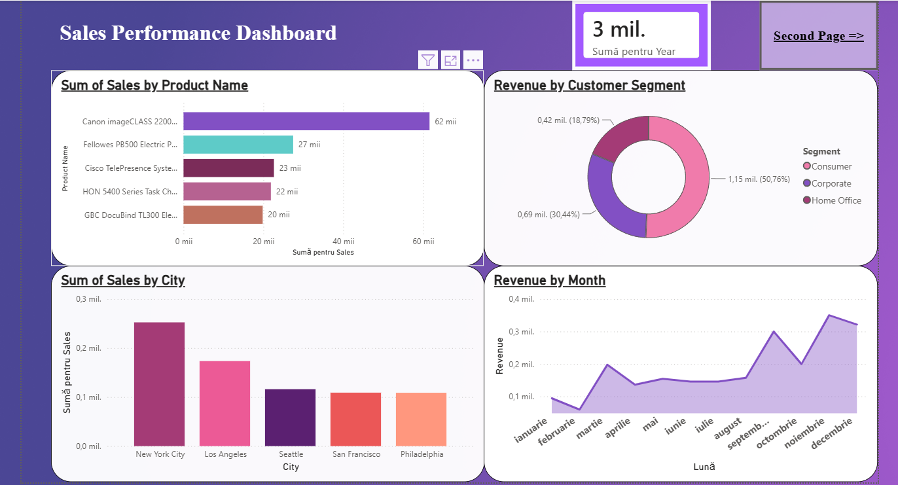
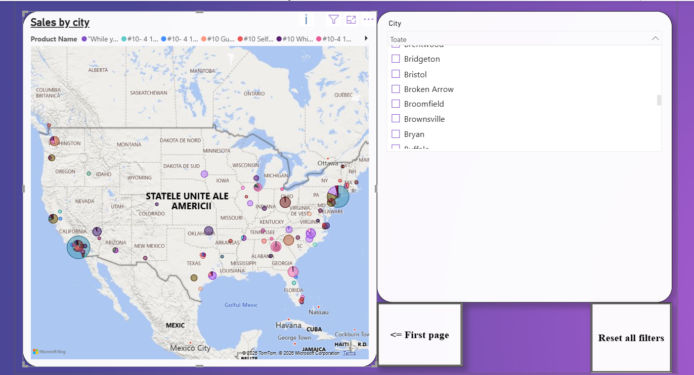

# Sales Performance Dashboard

## Overview

This project demonstrates an interactive Power BI dashboard built using Excel sales data to analyze business performance.

## Technologies

- Power BI
- Excel
- DAX

## Features

- KPI Cards (Total Sales)
- Sales by Product
- Sales by Month
- Sales by City
- Customer Segment Analysis
- Interactive Filters (Slicers)

## Dashboard Preview

### Main Dashboard

### Second Page

## Skills Demonstrated

- Data Visualization
- Interactive Reporting
- Data Modeling
- DAX Measures
- Business Intelligence
